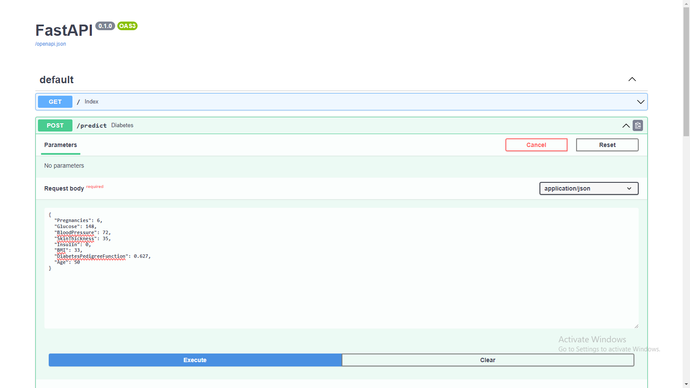
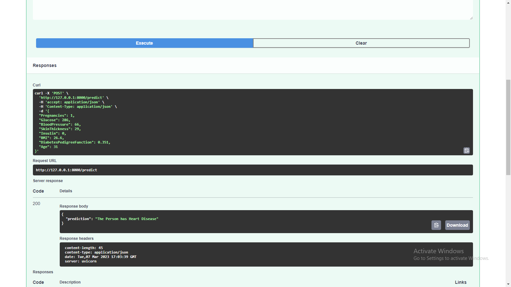
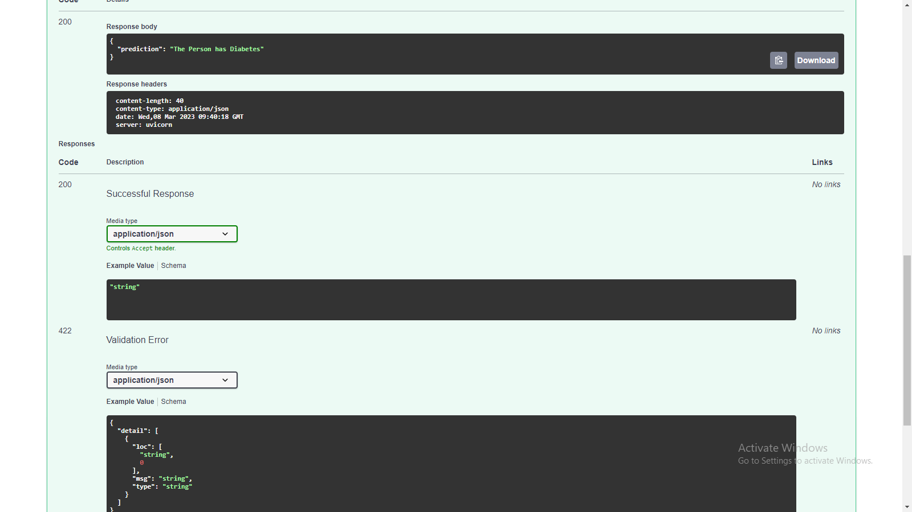

# Work-on-Pima-Indians-Diabetes-Database

<h2>Dataset Descriptions </h2>

This dataset is originally from the National Institute of Diabetes and Digestive and Kidney Diseases. The objective of the dataset is to diagnostically predict whether or not a patient has diabetes, based on certain diagnostic measurements included in the dataset.

<h1>Give your input </h1>
<!-- Model Output Prediction Images here  -->

<h1>Click on the executoin button </h1>
<!-- Model Output Prediction Images here  -->

<h1>See you results </h1>
<!-- Model Output Prediction Images here  -->

